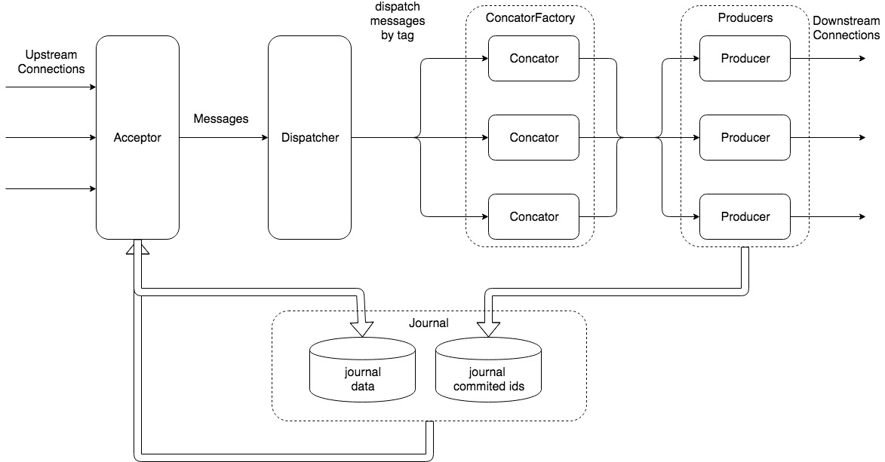

# Go-Fluentd

Rewrite fluentd-server by Golang, Higher performance with less resource requirement.

([中文文档](docs/README_cn.md))

[](http://commitizen.github.io/cz-cli/)

Ready for production.


## Description

LogAggregator + Concator + Parser + Producer.

Origin logs emitted from docker look like:

```
'{"container_id": "xxxxx", "log": "2018-03-06 16:56:22.514 | mscparea | ERROR  | http-nio-8080-exec-1 | com.pateo.qingcloud.cp.core.service.impl.CPBusiness.reflectAdapterRequest | 84:'
'{"container_id": "xxxxx", "log": "Exception in thread "main" java.lang.IllegalStateException: A book has a null property"}'
'{"container_id": "xxxxx", "log": "\tat com.example.myproject.Author.getBookIds(Author.java:38)"}'
'{"container_id": "xxxxx", "log": "\tat com.example.myproject.Bootstrap.main(Bootstrap.java:14)"}'
'{"container_id": "xxxxx", "log": "Caused by: java.lang.NullPointerException"}'
'{"container_id": "xxxxx", "log": "\tat com.example.myproject.Book.getId(Book.java:22)"}'
'{"container_id": "xxxxx", "log": "\tat com.example.myproject.Author.getBookIds(Author.java:35)"}'
'{"container_id": "xxxxx", "log": "\t... 1 more"}'
```

After Concator(TagPipeline > concator_f):

```go
&FluentMsg{
    Id: 12345,
    Tag: "spring.sit",
    Message: map[string]interface{}{
        "container_id": "xxxxx",
        "log": "2018-03-06 16:56:22.514 | mscparea | ERROR  | http-nio-8080-exec-1 | com.pateo.qingcloud.cp.core.service.impl.CPBusiness.reflectAdapterRequest | 84: Exception in thread "main" java.lang.IllegalStateException: A book has a null property\n\tat com.example.myproject.Author.getBookIds(Author.java:38)\n\tat com.example.myproject.Bootstrap.main(Bootstrap.java:14)\nCaused by: java.lang.NullPointerException\n\tat com.example.myproject.Book.getId(Book.java:22)\n\tat com.example.myproject.Author.getBookIds(Author.java:35)\n\t... 1 more",
    },
}
```

After Parser(TagPipeline > parser_f):

```go
&FluentMsg{
    Id: 12345,
    Tag: "spring.sit",
    Message: map[string]interface{}{
        "container_id": "xxxxx",
        "time": "2018-03-06 16:56:22.514",
        "level": "ERROR",
        "app": "mscparea",
        "thread": "http-nio-8080-exec-1",
        "class": "com.pateo.qingcloud.cp.core.service.impl.CPBusiness.reflectAdapterRequest",
        "line": 84,
        "message": "Exception in thread "main" java.lang.IllegalStateException: A book has a null property\n\tat com.example.myproject.Author.getBookIds(Author.java:38)\n\tat com.example.myproject.Bootstrap.main(Bootstrap.java:14)\nCaused by: java.lang.NullPointerException\n\tat com.example.myproject.Book.getId(Book.java:22)\n\tat com.example.myproject.Author.getBookIds(Author.java:35)\n\t... 1 more",
    },
}
```

Then Producer can send logs to anywhere (depends on Senders).


## Run

build:

```sh
docker build . -t ppcelery/go-fluentd:latest
```

run:

```sh
docker run -itd --rm --name=go-fluentd -p 24225:24225 -p 8080:8080 \
    -v /opt/configs/go-fluentd:/etc/go-fluentd \
    -v /data/log/fluentd/go-fluentd:/data/log/fluentd/go-fluentd
    ppcelery/go-fluentd:latest go-fluentd \
        --config=/etc/go-fluentd \
        --env=perf \
        --addr=0.0.0.0:8080
```


### docker images version

- stable
- release
- dev
- `<feature taskid>`


## Roles

- Acceptor (consists of Recvs)
- AcceptorPipeline (consists of AcceptorFilters)
- Journal
- Dispatcher
- TagPipeline (consists of TagFilters)
    - Concator
    - Parser for each tag
- PostPipeline (consists of PostFilters)
- Producer (consists of Senders)





### Acceptor

Contains multiply Recvs (such as KafkRecv & FluentdRecv),
can listening tcp port or fetch msg from kafka brokers.


### AcceptorPipeline

Contains multiply AcceptorFilters, be used for ignore or retag specific messages.
All filters should return very fast to avoid blocking.


### Journal

...


### Dispatcher

...


### TagPipeline

...


### PostPipeline

...


### Producer

...


