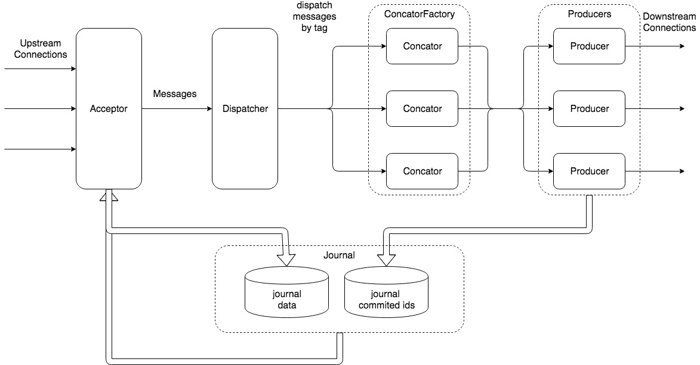

# Go-Fluentd

[](https://github.com/Laisky/go-fluentd/actions/workflows/go.yml)
[](https://github.com/Laisky/go-fluentd/actions/workflows/delivery.yml)
[](https://github.com/Laisky/go-fluentd/actions/workflows/readme.yml)
[](LICENSE)

A Go log-processing service that receives events, journals them to disk, combines
multiline records, parses and transforms fields, and routes results to one or
more destinations. It builds as a single executable.

**Legacy HTTP durable acceptance is opt-in; HTTP event receivers always wait for
it. Delivery guarantees depend on the complete pipeline.** A local journal is not
an unconditional no-loss or exactly-once promise. Read
[Delivery and durability](#delivery-and-durability) before deployment.

[Quickstart](#quickstart) · [Configuration](#configuration) ·
[Architecture](#architecture) · [Operations and security](#operations-and-security) ·
[Development](#development) · [Documentation](#documentation)

## Scope and compatibility

| Boundary | Configurable implementations |
| --- | --- |
| Inputs | Fluent Forward over TCP (`fluentd`), validated JSON HTTP (`http`), CloudEvents/NDJSON HTTP (`http_events`), Syslog (`rsyslog`), Kafka (`kafka`) |
| Processing | Admission filters, per-tag multiline concatenation, regular-expression/embedded-JSON parsing, field selection and tag rewriting |
| Outputs | Fluent TCP (`fluentd`), Elasticsearch bulk (`es`), Kafka (`kafka`), CloudEvents/NDJSON HTTP (`http_events`), console (`stdout`) |
| Persistence | Plain or gzip journal segments, replay, acknowledgement tracking, optional bounded group commit |
| OTLP (opt-in) | Dedicated authenticated OTLP/HTTP logs, metrics and traces service; JSON/protobuf, gzip and durable local acceptance. Separate from the legacy tag/filter pipeline. |
| Inspection | `/health`, JSON `/monitor`, and `/pprof/` on the management HTTP listener |

This is not the upstream Fluentd distribution and does not load its Ruby plugins
or configuration syntax. The repository contains a generic HTTP sender component,
but the configuration loader does **not** expose that legacy component as an output
type. The separate `http_events` plugins provide protocol-aware CloudEvents and
NDJSON inputs/outputs; see [HTTP event formats](docs/stream-formats.md) for the
support matrix, configuration, acknowledgement contract and operational limits.
Do not infer backend-version compatibility from a protocol name: validate your
actual Fluent, Kafka and Elasticsearch deployment, including bulk metadata and
acknowledgement behavior, before rollout.

**OTLP/HTTP is an opt-in, bounded implementation, not a full Collector replacement.**
See the [tested settings](docs/settings/otlp.yml), [service guide](docs/otlp-service.md)
and [Collector 0.161.0 interoperability scope](docs/otlp-collector-acceptance.md).
HTTP 200 means local journal synchronization, not completed downstream delivery.
Per-destination receipts have no compaction or aggregate disk quota; plan storage
headroom. OTLP/gRPC, profiles, aggregation and sampling are not supported.

These instructions describe the checked-out source, not an older release image.
[go.mod](go.mod) is the toolchain/dependency source of truth. The current minimum
is **Go 1.27**; CI exercises the 1.27 patch line on Linux. Python 3 and `curl` are
needed for the quickstart checks; Docker is optional. This application uses the
module name `gofluentd`, so build from a checkout rather than assuming
`go install github.com/Laisky/go-fluentd@latest` is supported.

## Quickstart

This local-only demo runs **HTTP → journal → console**. It requires no Kafka,
Elasticsearch, credentials, or externally hosted image. The console is an
intentional terminal demo sink: seeing a log line is not durable downstream storage.

### Build and start

```sh
git clone https://github.com/Laisky/go-fluentd.git
cd go-fluentd
```

<!-- readme-check:build -->
```sh
go mod download
go mod verify
mkdir -p build
go build -mod=readonly -o build/go-fluentd .
./build/go-fluentd --help
```

Run this in the repository root and leave it running:

<!-- readme-check:run -->
```sh
mkdir -p var/go-fluentd/journal
./build/go-fluentd \
  --config=docs/settings/quickstart.yml \
  --env=sit \
  --addr=127.0.0.1:8080 \
  --log-level=info
```

The [demo configuration](docs/settings/quickstart.yml) enables durable HTTP
acceptance, uses per-record synchronization, and keeps its journal under the
working directory's `var/go-fluentd/journal`. It uses a public **demo-only** salt.
Do not run two processes against the same journal directory.

### Send and observe an event

In a second terminal, from the same repository root:

<!-- readme-check:request -->
```sh
mkdir -p var/quickstart
python3 - <<'PY'
import datetime
import hashlib
import json
from pathlib import Path

ts = datetime.datetime.now(datetime.timezone.utc).strftime("%Y-%m-%dT%H:%M:%SZ")
salt = "local-demo-only-not-a-production-secret"
event = {
    "event": "readme-demo-001",
    "message": "hello from the README",
    "nested": {"source": "quickstart"},
    "ts": ts,
    "sig": hashlib.md5((ts + salt).encode()).hexdigest(),
}
Path("var/quickstart/request.json").write_text(json.dumps(event))
PY
curl --fail-with-body --silent --show-error \
  -H 'Content-Type: application/json' \
  --data-binary @var/quickstart/request.json \
  http://127.0.0.1:8080/ingest/sit
```

Expect HTTP `200` with a JSON object such as `{"msgid":42}`; the number is assigned
at runtime. The first terminal should show `consume msg` containing
`readme-demo-001`, `hello from the README`, and `nested__source:quickstart`.
The HTTP receiver flattens nested objects with `__`. Repeated demo requests can
appear more than once: the application's producer-supplied `event` field is not
an ingress deduplication key.

<!-- readme-check:health -->
```sh
curl --fail --silent --show-error http://127.0.0.1:8080/health
curl --fail --silent --show-error http://127.0.0.1:8080/monitor
```

`/health` returns `hello, world`; it proves the HTTP listener responds, not that
all destinations are healthy or the backlog is drained. Stop the demo with
Ctrl-C. Keep `var/go-fluentd/journal` for restart/replay; delete it only when you
intentionally discard this demo's state and the process is stopped.

See [Quickstart troubleshooting](docs/quickstart.md) for HTTP errors, ports,
permissions, and the exact tag mapping.

### Run the same demo in Docker

Stop the native demo first; both examples use port 8080 and the same host state.
Build the image from this checkout instead of assuming a historical published
tag contains the current reliability fixes.

<!-- readme-check:docker-build -->
```sh
docker build -f .docker/Dockerfile -t go-fluentd:local .
```

<!-- readme-check:docker-run -->
```sh
mkdir -p var/go-fluentd/journal
docker run --rm --name go-fluentd-demo \
  --user "$(id -u):$(id -g)" \
  --read-only --cap-drop=ALL --security-opt=no-new-privileges \
  --workdir=/work \
  --publish 127.0.0.1:8080:8080 \
  --mount "type=bind,src=$PWD/docs/settings/quickstart.yml,dst=/etc/go-fluentd/settings.yml,readonly" \
  --mount "type=bind,src=$PWD/var,dst=/work/var" \
  --tmpfs /tmp:rw,nosuid,nodev,noexec,size=16m \
  go-fluentd:local \
  --config=/etc/go-fluentd/settings.yml \
  --env=sit --addr=0.0.0.0:8080 --log-level=info
```

Reuse the send/check commands above, then stop with `docker stop go-fluentd-demo`.
The host `var` directory survives container removal. The UID/GID must be able to
write it; avoid making it world-writable. The image already has an entrypoint, so
do not append `./go-fluentd` before its flags. MooseFS/forward image recipes under
`.docker/` are legacy deployment-specific paths, not this self-contained demo.

## Configuration

Start with the small tested example, then consult the annotated
[English settings](docs/settings/settings.yml) or
[Chinese settings](docs/settings/settings_cn.yml) for plugin-specific fields.
Those larger configurations are references, not safe production defaults.

| Setting | Meaning and deployment consequence |
| --- | --- |
| `--config`, `--env`, `--addr` | Configuration path, plugin environment, and management/HTTP-input listener. Other receivers have their own `addr`. Use `--help` for actual flags. |
| Plugin `active_env` | The receiver/sender is enabled only when its list includes `--env`. A valid-looking configuration can still activate no matching destination. |
| Tags | Naming rules differ by plugin: some append the environment; some replace `{env}`; some use the tag verbatim. Match the effective tag, not only the example's label. |
| `journal.buf_dir_path` | Durable state directory. Assign one writable persistent directory per process; protect it from cleanup jobs and concurrent writers. |
| `journal.buf_file_bytes` | Segment sizing/rotation parameter, **not** a total-disk quota. Plan for sustained downstream outages and monitor free space. |
| HTTP `require_durable_ack` | Defaults to `false`. Set `true` to wait for local journal synchronization before HTTP success. |
| `journal.group_commit_max_messages` | Omitted, `0`, or `1`: per-record Sync. Opt in with `64` after measuring your workload; maximum `1024`. Ready messages share a barrier; no batching timer waits for more. |
| `journal.committed_id_sec` | Recent-confirmation cache retention, not a deadline after which undelivered messages may be safely deleted. |
| `is_discard_when_blocked`, `--dry`, filters, stdout `is_commit` | Explicitly affect loss/acknowledgement behavior. Do not enable them accidentally in a reliability-sensitive pipeline. |

Configuration is loaded on startup; plan a controlled restart to apply changes.
Keep destination definitions, tag routing, and journal state consistent through
upgrades. Use an exact reviewed commit/image digest in deployments and validate
with representative messages before switching traffic.

## Delivery and durability

**Local acceptance, destination success, and final storage durability are three
different events.** With `require_durable_ack: true`, validated HTTP records
receive `200` only after journal writes and a successful synchronization barrier.
Queue pressure before persistence waits rather than bypassing that guarantee;
pre-persistence rejection or storage failure returns `503`. A request timeout or
connection loss has an **unknown outcome**; retrying may duplicate the event.

The producer collects results from all matching configured senders before
confirming delivery. Replay preserves the original journal owner even after tag
rewriting. Still, the meaning of a sender's success depends on its protocol:
Fluent TCP encode/flush success is not a Fluent Forward application-level ACK or
a downstream durable-store receipt. Whole-batch retries can repeat successful
items after a partial failure.

At-least-once expectations require retained writable state, correct routes and
filters, all required destinations enabled, explicit lossy modes disabled, and
an end-to-end acknowledgement contract appropriate for the destination. There
is no exactly-once guarantee. Best-effort/UDP inputs and a successful TCP write
cannot inherit the reliable HTTP acceptance contract. The console demo confirms
its output according to `is_commit: true`; it is not a production storage sink.

The [delivery contract and executable tests](tests/delivery/README.md) cover
process kills, restart, backpressure, failed/ambiguous acknowledgements and real
write failures. They are not host-power-loss or real-cluster certification.
Interrupted newest appends may produce `.incomplete` evidence files; preserve
and inspect them rather than deleting or rewriting journal files to clear an
error. See [reliability notes](docs/reliability.md) for the recovery design and
historical fixes; use the current `go.mod` for the exact dependency revision.

## Architecture



[Editable diagram source](docs/architecture.xml).

```text
Receivers → admission filters → journal → dispatcher → per-tag filters
                                                     → post-filters → producer → senders
                                  ↑                         acknowledgements ────────┘
                                  └── replay unconfirmed records after restart/failure
```

| Component | Responsibility |
| --- | --- |
| Acceptor | Binds receivers to shared ID allocation and input queues; resumes allocation above retained journal IDs. |
| AcceptorPipeline | Admission, early tag changes, filtering and backpressure. Explicit best-effort bypass paths are not durable acceptance. |
| Journal | Writes per-tag data/confirmation files, provides acceptance barriers, restores records and controls safe reclamation. |
| Dispatcher | Routes each effective tag into its tag pipeline. |
| TagPipeline | Runs multiline concatenation and parsing; combined messages retain all original acknowledgement IDs. |
| PostPipeline | Normalizes, selects or rewrites fields/tags after journaling. Filters may intentionally discard records. |
| Producer | Fans out to matching senders, collects their results and sends confirmations back to the originating journal. |

The code entry points are [configuration wiring](internal/controller/controllor.go),
[journal management](internal/controller/journal.go), and
[the bounded journal writer](internal/controller/journal_writer.go). Plugins are
compiled Go components, not dynamically loaded third-party Fluentd plugins.

## Operations and security

Keep the legacy management/JSON-input listener, `/monitor`, and `/pprof/` on
loopback or a protected management network. That listener does not supply a
public-facing authentication or TLS boundary; use authenticated TLS termination and network controls. Do not
publish profiling endpoints through a public ingress. `--addr` does not change
the addresses configured for Fluent/Syslog receivers. The separate opt-in OTLP
listener requires bearer authentication and TLS for non-loopback addresses; it
does not expose the management routes.

The HTTP input's legacy `MD5(timestamp + salt)` check does **not** authenticate
the message body or prevent replay. It is not a replacement for TLS, caller
authentication, authorization, or a modern request-signature scheme. Never reuse
the public demo salt as a production secret. Treat configuration and diagnostic
output as sensitive; do not commit live credentials or log payloads in issues.

Run with a least-privilege account and a writable persistent journal mount.
Journal files are not automatically encrypted at rest. Bound access, disk usage
and retention at the deployment layer; ensure enough headroom for retries and
recovery. Watch errors, free space, backlog/queue depth, receiver/output rates,
and `producer.waitToDiscardMsgNum`. The JSON monitor is diagnostic information,
not a stable delivery receipt or a substitute for downstream checks.

Do not assume SIGTERM drains every pipeline stage. Preserve state, stop ingress
in a controlled rollout, allow recovery, and test the supervisor/storage setup.
Do not enable forced-GC options as an unmeasured performance shortcut.

For vulnerability reports, use the repository's **Security** tab private-report
option when available. Otherwise ask for a private reporting contact in an issue
**without** including vulnerability details, secrets, or exploit material. No
response-time SLA or independent security certification is claimed here.

## Performance

Performance changes require matched workloads and delivery evidence, not only a
higher operations/second count. The suite measures per-component time,
allocations, journal recovery, and full-process durable acceptance/delivery.
Compare the same commit policies, toolchain, CPU and filesystem, and preserve
unfavorable samples too. Group commit can benefit concurrent traffic but has
mixed low-load/latency results, which is why it remains opt-in.

Use the [benchmark guide](tests/performance/README.md),
[component performance report](docs/performance.md), and
[group-commit report](docs/group-commit-performance.md). Their figures are dated,
workload-specific experiments, **not** a universal throughput or production-disk
capacity promise. Historical screenshots are not a current benchmark baseline.

## Development

```sh
go mod verify
go build -mod=readonly ./...
go vet -mod=readonly ./...
go test -mod=readonly -count=1 -timeout=180s ./...
go test -mod=readonly -race -count=1 -shuffle=on -timeout=180s ./...
```

The race detector requires a supported platform and C toolchain. On Linux, run
the independent executable delivery tests as well:

```sh
mkdir -p build
go build -mod=readonly -race -o build/go-fluentd-delivery .
GORACE='halt_on_error=1 exitcode=66' python3 tests/delivery/run.py \
  --binary build/go-fluentd-delivery --artifacts /tmp/go-fluentd-delivery-results \
  --seed 127 --group-max-messages 1
```

Repeat with `--group-max-messages 64` and a separate artifact directory when
changing grouping. Tests validate actual input/output records; higher coverage
alone does not establish reliable delivery. See
[component tests](docs/component-testing.md) and the delivery guide for the full
matrix and limits. Performance measurements run **without** race instrumentation.

The README examples are executable tests too:

```sh
python3 .scripts/check_readme.py --static
python3 .scripts/check_readme.py --native
python3 .scripts/check_readme.py --docker
```

The smoke checks use port 8080 and a temporary copy of the example state; stop any
existing demo first. They verify the actual README commands, HTTP acceptance,
console payload, health/monitor responses, and invalid-request behavior.

## Documentation

| Topic | Start here |
| --- | --- |
| Tested demo and troubleshooting | [Quickstart](docs/quickstart.md) |
| OTLP service and real Collector acceptance | [Service](docs/otlp-service.md) / [settings](docs/settings/otlp.yml) / [acceptance](docs/otlp-collector-acceptance.md) |
| Full configuration reference | [English](docs/settings/settings.yml) / [Chinese](docs/settings/settings_cn.yml) |
| Reliability and recovery | [Design notes](docs/reliability.md) / [executable contract](tests/delivery/CONTRACT.md) |
| Behavior tests | [Component testing](docs/component-testing.md) / [delivery tests](tests/delivery/README.md) |
| Benchmarks and retained evidence | [Performance guide](tests/performance/README.md) / [group commit](tests/performance/GROUP_COMMIT.md) |
| Older material | [Chinese guide](docs/README_cn.md), [release history](CHANGELOG.md), and `docs/example/` are historical context; check current source/examples before reuse. |

## Contributing and support

Use [issues](https://github.com/Laisky/go-fluentd/issues) for non-sensitive bug
reports and questions. Include the exact commit, Go/OS versions, a redacted
configuration, reproducible input, expected/actual output, and relevant logs.
For performance reports, include raw paired samples, work units, concurrency,
compression, storage and synchronization policy—not only a percentage.

Open a focused pull request against `master`. Reproduce behavior before fixing
it, keep passing controls, add regression tests, run the checks above, and update
configuration/examples when contracts change. Avoid unrelated refactoring or
claiming compatibility that has not been tested. Project maintenance and
contributor history are visible in the repository and pull requests.

## License

[MIT](LICENSE). Third-party dependencies retain their respective licenses.
